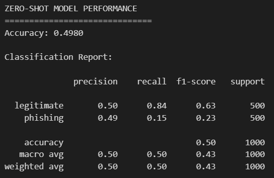
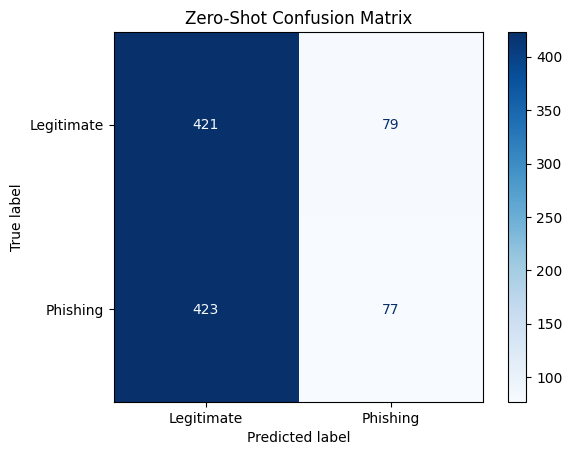
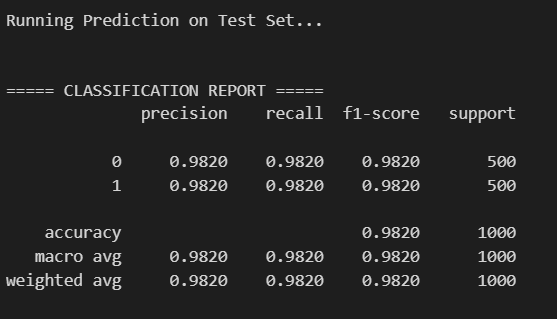
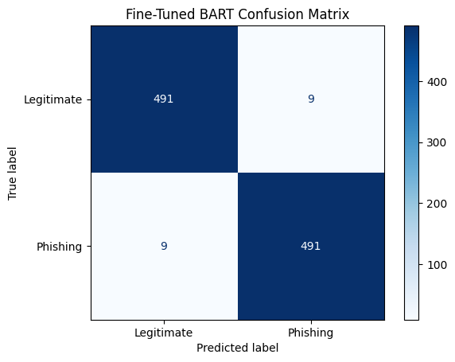
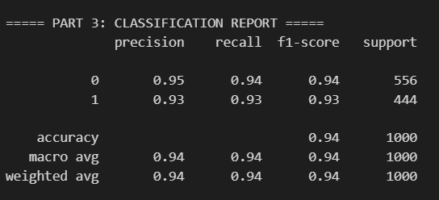
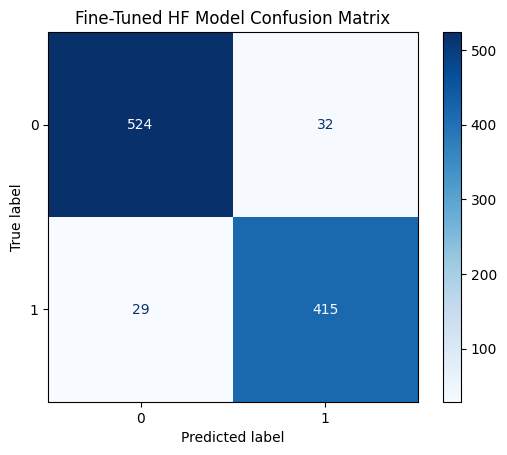

# NLP Phishing Detection Suite

This project contains data, notebooks and model artifacts produced for the purpose of phishing-email detection. It demonstrates data preprocessing, baseline experiments, and fine-tuning of transformer models (BART and DistilBERT) for binary phishing classification. The repository is organized for clarity and reproducibility.

What changed (layout & files)
- Notebooks grouped by part: `notebooks/Part1`, `notebooks/Part2`, `notebooks/Part3`.
- Reports and screenshots consolidated under `docs/reports/images` and `docs/reports/*.pdf`.
- Complete written solution: `docs/Complete_Solution.docx`.
- Model artifacts collected under `models/`.

Repository structure (now)
- `notebooks/` — Part1/Part2/Part3 notebooks
- `data/` — datasets: `phishing_email.csv`, `combined_full.json`
- `models/` — model checkpoints and tokenizers (large files should use Git LFS or external hosting)
- `docs/` — reports

What each task covers
- Part 1 — Baselines & preprocessing: EDA, text cleaning, and baseline classifiers (data preparation and quick baselines to establish a reference).
- Part 2 — Transformer fine-tuning (BART): Fine-tuning a BART-based classifier for phishing detection; achieved top performance after supervised training.
- Part 3 — Lightweight transformer (DistilBERT) experiments and comparative analysis: fine-tuning DistilBERT and comparing metrics and trade-offs.

Key results (summary)
- Task 1 (zero-shot BART): Accuracy ≈ 0.50 (zero-shot; not suitable for production).
- Task 2 (fine-tuned BART): Accuracy ≈ 0.98 (best-performing model in this work).
- Task 3 (fine-tuned DistilBERT): Accuracy ≈ 0.94 (good trade-off between accuracy and inference cost).

Output snapshots (images provided in `docs/reports/images/`)

- Part 1
	- Question A: `docs/reports/images/1.png`

		

	- Question B: `docs/reports/images/1_2.png`

		

- Part 2
	- Question A: `docs/reports/images/2.png`

		

	- Question B: `docs/reports/images/2_2.png`

		

- Part 3
	- Question A: `docs/reports/images/3.png`

		

	- Question B: `docs/reports/images/3_2.png`

		
